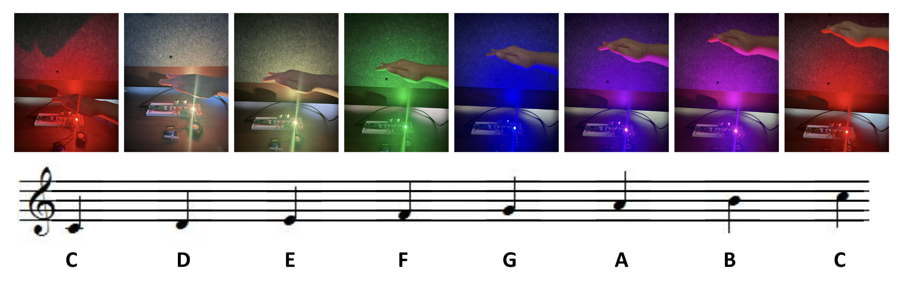
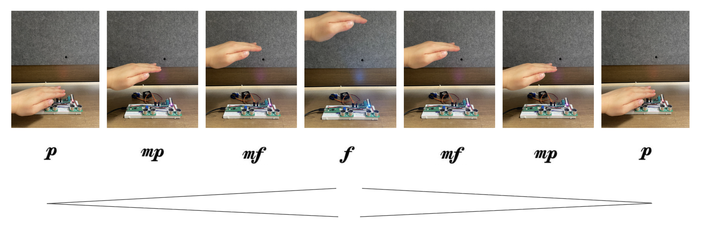
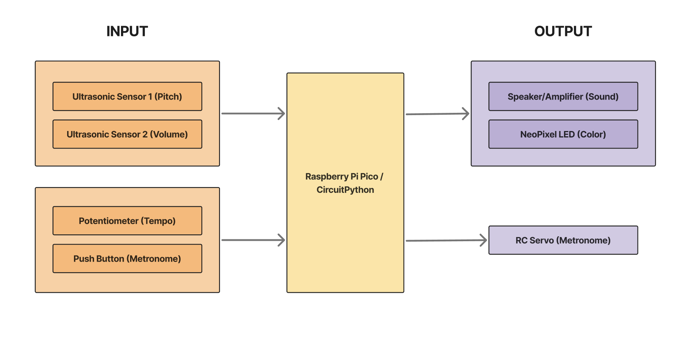
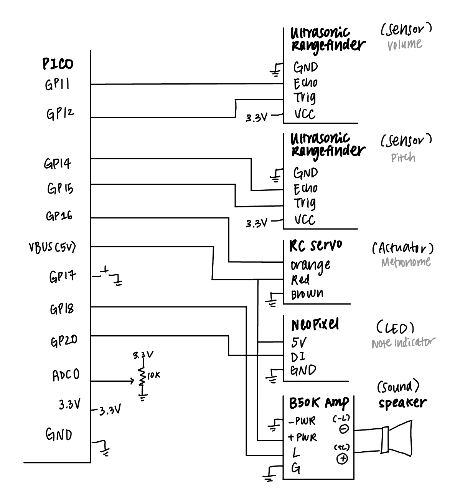

# The Airchestra Project

## 📋 Project Description
Traditional music education often depends on physical instruments and precise motor control, creating barriers for students with mobility or dexterity challenges. Airchestra reimagines how students engage with sound by transforming hand gestures into music, color, and rhythm.

Using two ultrasonic rangefinders, students can play and shape sound directly in the air. One sensor detects the distance of the hand to control pitch, while the other modulates volume, allowing for dynamic expression without physical contact. A NeoPixel light changes color with each pitch, offering visual reinforcement that bridges auditory and visual learning. In addition to tone and volume control, Airchestra includes an interactive metronome powered by an RC servo motor. With the press of a button, students can start or stop the metronome and use a potentiometer to adjust the tempo. 

By using one hand to control pitch and the other hand to control volume, students can develop skills fundamental to orchestral conducting, such as independent hand coordination, expressive dynamics, and precise control of musical phrasing. This multisensory design not only enhances accessibility in music classrooms but also provides a creative, engaging way for choir students to connect solfege hand motions with sound and color, bridging motion, music, and inclusivity.
  

## 🎵 Airchestra in Action

  

<html lang="en">
<head>
  <meta charset="UTF-8">
  <title>Three Videos</title>
  
</head>
<body>

  

    <video controls>
      <source src="images/notes.mp4" type="video/mp4">
      Your browser does not support the video tag.
    </video>

    <video controls>
      <source src="images/metupdated.mp4" type="video/mp4">
      Your browser does not support the video tag.
    </video>

    <video controls>
      <source src="images/combined.mp4" type="video/mp4">
      Your browser does not support the video tag.
    </video>
  

</body>
</html>

## 🛠️ Technical Overview

| **Category** | **Details** |
|---------------|-------------|
| **Microcontroller** | Raspberry Pi Pico |
| **Input Components** | - Ultrasonic Rangefinder (Pitch Control) - Ultrasonic Rangefinder (Volume Control) - Potentiometer (Tempo Adjustment) - Push Button (Metronome Activation) |
| **Output Components** | - Speaker, Amplifier (Audio Output) - NeoPixel RGB LED (Visual Feedback) - RC Servo Motor (Metronome Arm) |
| **Core Functions** | - Maps hand distance (ultrasonic input) to pitch and volume - Synchronizes LED color transitions with pitch frequency - Uses potentiometer to adjust metronome tempo - Activates/deactivates metronome via button press |
| **Programming Language** | CircuitPython |
| **Educational Impact** | - Encourages inclusive participation in music education - Reinforces pitch and rhythm learning through multisensory feedback - Enables gesture-based musical interaction |

## 👷‍♀️ System Architecture

  

## 💡 Circuit Diagram

  

## 👩‍💻 Code

<section>
  <pre><code>
import time
import board
import pwmio
import analogio
import digitalio
import neopixel
from adafruit_motor import servo
import math

\# --- Pin Setup ---
\# Servo on GP16
pwm_servo = pwmio.PWMOut(board.GP16, variable_frequency=True)
my_servo = servo.Servo(pwm_servo)

\# Button on GP17
button = digitalio.DigitalInOut(board.GP17)
button.switch_to_input(pull=digitalio.Pull.UP)

\# Potentiometer on ADC0 (GP26)
pot = analogio.AnalogIn(board.A0)

\# Ultrasonic Sensors
\# Pitch sensor (Trig: GP15, Echo: GP14)
trig_pitch = digitalio.DigitalInOut(board.GP15)
trig_pitch.direction = digitalio.Direction.OUTPUT
echo_pitch = digitalio.DigitalInOut(board.GP14)
echo_pitch.direction = digitalio.Direction.INPUT

\# Volume sensor (Trig: GP12, Echo: GP11)
trig_vol = digitalio.DigitalInOut(board.GP12)
trig_vol.direction = digitalio.Direction.OUTPUT
echo_vol = digitalio.DigitalInOut(board.GP11)
echo_vol.direction = digitalio.Direction.INPUT

\# Speaker on GP18
pwm_speaker = pwmio.PWMOut(board.GP18, variable_frequency=True)

\# Neopixel on GP20
pixels = neopixel.NeoPixel(board.GP20, 1, brightness=0.2)

\# --- Variables ---
metronome_on = False
last_button_state = True
last_beat_time = 0
my_servo.angle = 90

\# --- Helper Functions ---
def get_distance_cm(trig, echo):
    """Measure distance using ultrasonic rangefinder"""
    trig.value = True
    time.sleep(0.00001)
    trig.value = False

    start = time.monotonic()
    while not echo.value:
        if time.monotonic() - start > 0.02:
            return None
    start_time = time.monotonic()

    while echo.value:
        if time.monotonic() - start > 0.02:
            return None
    end_time = time.monotonic()

    duration = end_time - start_time
    distance_cm = duration * 34300 / 2  # speed of sound = 343 m/s
    return distance_cm

def get_smoothed_distance(trig, echo, window, max_size=8):
    """Return smoothed distance using a rolling average"""
    dist = get_distance_cm(trig, echo)
    if dist:
        window.append(dist)
        if len(window) > max_size:
            window.pop(0)
    if not window:
        return None
    return sum(window) / len(window)

\# --- Metronome Helpers ---
def get_pot_bpm():
    pot_val = pot.value
    bpm = 60 + int((pot_val / 65535) * 140)
    return bpm

def hit_servo():
    my_servo.angle = 60
    time.sleep(0.05)
    my_servo.angle = 120
    time.sleep(0.05)
    my_servo.angle = 90

\# --- Mapping Functions ---
def map_value(x, in_min, in_max, out_min, out_max):
    """Map x from one range to another"""
    return max(min((x - in_min) * (out_max - out_min) / (in_max - in_min) + out_min, out_max), out_min)

def get_pitch_from_distance(distance):
    """Map pitch distance (cm) to frequency from C4 to C5 (261–523 Hz)"""
    if distance is None:
        return None
    freq = map_value(distance, 5, 50, 261, 523)
    return freq

def get_volume_from_distance(distance):
    """Map volume distance (cm) to duty cycle with ultra-dramatic dynamic range,
       closest = very quiet, farthest = loudest"""
    if distance is None:
        return 0

    # Normalize: 5cm = 0.0 (closest), 50cm = 1.0 (farthest)
    scaled = map_value(distance, 5, 50, 0.0, 1.0)

    # Exponential curve for ultra-dramatic dynamic range
    scaled = scaled ** 6  # higher exponent => more drastic changes

    # Map to actual duty cycle range for speaker
    min_duty = 500      # very quiet at closest distance
    max_duty = 2**15    # max volume at farthest
    duty = int(scaled * (max_duty - min_duty) + min_duty)
    return duty

\# --- Color Mapping ---
def get_color_from_frequency(freq):
    """Generate RGB color that follows the spectrum as pitch increases"""
    if freq is None:
        return (0, 0, 0)
    norm = (freq - 261) / (523 - 261)
    hue = norm * 360
    return hsv_to_rgb(hue, 1.0, 1.0)

def hsv_to_rgb(h, s, v):
    """Convert HSV to RGB (0–360, 0–1, 0–1)"""
    c = v * s
    x = c * (1 - abs((h / 60) % 2 - 1))
    m = v - c
    if h < 60:
        r, g, b = c, x, 0
    elif h < 120:
        r, g, b = x, c, 0
    elif h < 180:
        r, g, b = 0, c, x
    elif h < 240:
        r, g, b = 0, x, c
    elif h < 300:
        r, g, b = x, 0, c
    else:
        r, g, b = c, 0, x
    return (int((r + m) * 255), int((g + m) * 255), int((b + m) * 255))

\# --- Distance Windows ---
pitch_window = []
vol_window = []

\# --- Main Loop ---
print("🎶 Airchestra: Dual Ultrasonic Pitch + Ultra-Volume + Visual Spectrum Active 🎶")

while True:
    \# --- Metronome Toggle ---
    current_state = button.value
    if not current_state and last_button_state:
        metronome_on = not metronome_on
        print("Metronome ON" if metronome_on else "Metronome OFF")
        time.sleep(0.3)
    last_button_state = current_state

    # --- Metronome Section ---
    if metronome_on:
        bpm = get_pot_bpm()
        beat_interval = 60 / bpm
        current_time = time.monotonic()
        if current_time - last_beat_time >= beat_interval:
            hit_servo()
            last_beat_time = current_time
    else:
        my_servo.angle = 90

    # --- Read Distances ---
    pitch_dist = get_smoothed_distance(trig_pitch, echo_pitch, pitch_window)
    vol_dist = get_smoothed_distance(trig_vol, echo_vol, vol_window)

    # --- Map to Frequency + Volume ---
    freq = get_pitch_from_distance(pitch_dist)
    duty = get_volume_from_distance(vol_dist)

    # --- Output to Speaker + NeoPixel ---
    if freq and duty > 0:  # play only if valid readings
        pwm_speaker.frequency = int(freq)
        pwm_speaker.duty_cycle = duty
        pixels.fill(get_color_from_frequency(freq))
    else:
        pwm_speaker.duty_cycle = 0
        pixels.fill((0, 0, 0))

    time.sleep(0.05)

  </code></pre>
</section>

